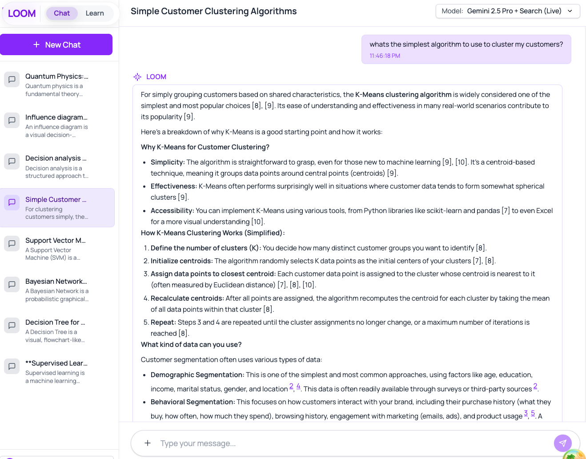
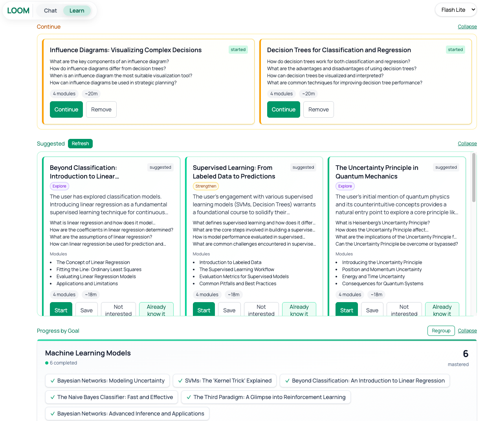

# LOOM - AI-Powered Learning Assistant

> Personalized learning informed by daily LLM conversations toward long-term mastery via a learner memory graph.

## 🎥 Demo

**[➤ Watch Demo Video](https://youtu.be/RuLg0wHLd-k)**

---

## Screenshots

### Chat Mode

*AI-powered conversations with multi-model support and persistent history*

### Learn Mode

*Automatically generated courses from chat history with progress tracking*

---

## Overview

LOOM is an agentic pipeline that transforms everyday LLM conversations into personalized learning trajectories through four stages:

1. **Conversation Observation & Summarization** - Extracts learning signals from chat interactions
2. **Topic Decision & Course Outline** - Identifies learning opportunities using a dynamic learner memory graph
3. **Course Content Generation** - Creates personalized modules with lessons and quizzes
4. **Progress Tracking & Graph Updates** - Refines the learner model based on engagement and outcomes

---

## Getting Started

### Prerequisites
- Node.js 18+ and npm 9+
- Gemini API key (free from https://ai.google.dev/)

### Installation

```bash
npm install
npm run dev
```

The app runs at `http://localhost:5173`

### Configuration

1. Open Settings (⚙️ icon)
2. Add your Gemini API key

